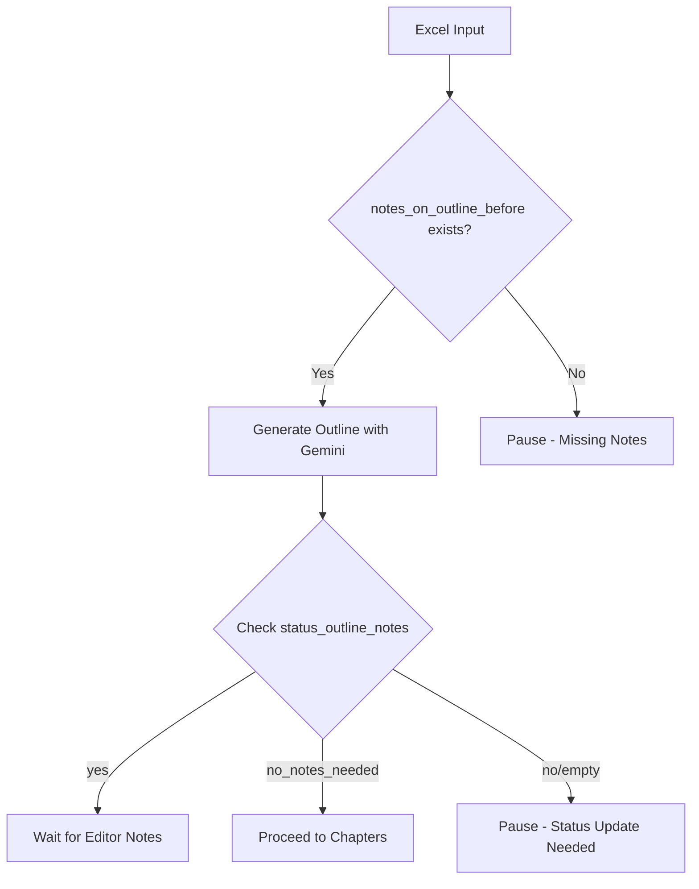
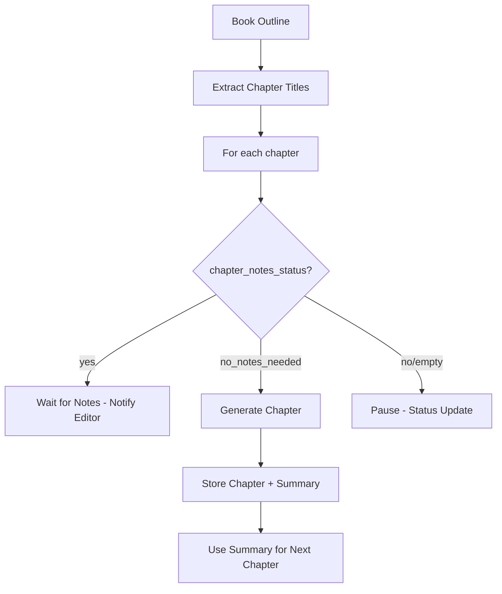
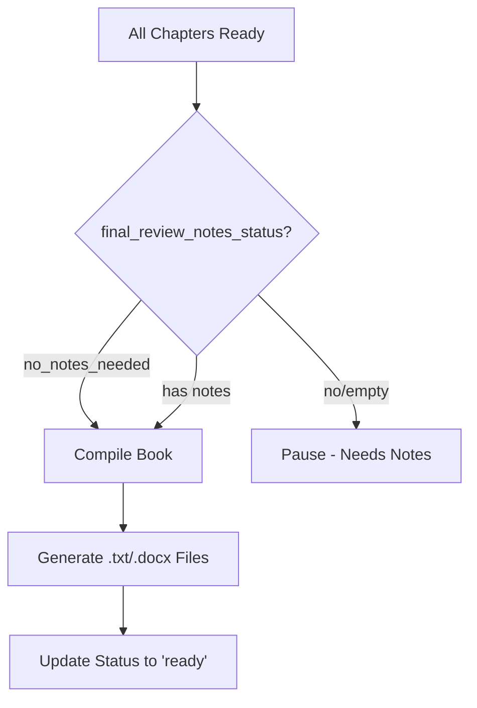

# Automated Book Generation System 📚🤖

A modular, scalable, and AI-powered system that automates the entire book generation process - from title to compiled manuscript. This system integrates Supabase for data management, Gemini AI for content generation, and supports human-in-the-loop feedback at every stage.

## 🌟 Features

### ✅ **Complete Workflow Automation**
- **Stage 1:** Excel Import → Outline Generation
- **Stage 2:** Outline → Chapter Generation with Context Chaining
- **Stage 3:** Chapters → Final Book Compilation

### ✅ **Human-in-the-Loop Design**
- Editors can add notes before/after outline generation
- Chapter-by-chapter review and feedback system
- Conditional gating logic at every stage

### ✅ **Smart AI Integration**
- Gemini AI for high-quality content generation
- Context chaining between chapters
- Configurable temperature and token limits

### ✅ **Professional Output**
- Generates `.txt` files (mandatory)
- Optional `.docx` Word document generation
- Clean, formatted book structure

## 🏗️ System Architecture

```
📁 Book Generation System
├── 📊 config.py           # Configuration management
├── 🗄️ db.py              # Supabase database operations
├── 🧠 llm.py             # Gemini AI integration
├── 📥 input_excel.py     # Excel file import
├── 🔔 notifications.py   # Email/Teams notifications
├── 📝 workflow_outline.py    # Outline generation
├── 📖 workflow_chapters.py   # Chapter generation
├── 📑 workflow_compile.py    # Book compilation
├── 🎯 main.py            # CLI controller
└── ⚙️ config.yaml        # Settings file
```

## 📋 Prerequisites

### **Software Requirements**
- Python 3.10+
- Supabase account
- Google Gemini API key
- SMTP credentials (for email notifications)
- MS Teams webhook URL (optional)

### **Python Dependencies**
```bash
pip install -r requirements.txt
```

## 🚀 Quick Start

### **1. Clone and Setup**
```bash
git clone <repository-url>
cd book-gen-system
pip install -r requirements.txt
```

### **2. Configure Settings**
```bash
cp config.yaml.example config.yaml
# Edit config.yaml with your credentials
```

### **3. Set Up Database**
Run these SQL commands in Supabase:
```sql
-- Create books table
CREATE TABLE books (
    id UUID PRIMARY KEY DEFAULT gen_random_uuid(),
    title TEXT NOT NULL,
    notes_on_outline_before TEXT,
    outline TEXT,
    notes_on_outline_after TEXT,
    status_outline_notes TEXT CHECK (status_outline_notes IN ('yes','no','no_notes_needed')),
    final_review_notes TEXT,
    final_review_notes_status TEXT CHECK (final_review_notes_status IN ('yes','no','no_notes_needed')),
    book_output_status TEXT DEFAULT 'pending',
    created_at TIMESTAMPTZ DEFAULT NOW(),
    updated_at TIMESTAMPTZ DEFAULT NOW()
);

-- Create chapters table
CREATE TABLE chapters (
    id UUID PRIMARY KEY DEFAULT gen_random_uuid(),
    book_id UUID REFERENCES books(id) ON DELETE CASCADE,
    chapter_number INT NOT NULL,
    chapter_title TEXT,
    content TEXT,
    summary TEXT,
    chapter_notes TEXT,
    chapter_notes_status TEXT CHECK (chapter_notes_status IN ('yes','no','no_notes_needed')),
    created_at TIMESTAMPTZ DEFAULT NOW(),
    updated_at TIMESTamptz DEFAULT NOW(),
    UNIQUE (book_id, chapter_number)
);
```

### **4. Create Excel Input File**
Create `inputs/books.xlsx` with these columns:
- `title` (mandatory)
- `notes_on_outline_before` (required for outline generation)
- `status_outline_notes` (yes/no/no_notes_needed)

Example:
```excel
title,notes_on_outline_before,status_outline_notes
The Future of AI in Finance,Focus on risk management...,yes
Blockchain Revolution in Banking,Explore DeFi and smart contracts...,no_notes_needed
```

## 📖 Usage

### **Complete Workflow**
```bash
# 1. Import books from Excel
python main.py import-from-excel --excel-path inputs/books.xlsx

# 2. Generate outlines
python main.py generate-outlines

# 3. Generate chapters
python main.py generate-chapters

# 4. Compile final books
python main.py compile-books
```

### **Individual Commands**
```bash
# Import only
python main.py import-from-excel --excel-path <path>

# Generate outlines only
python main.py generate-outlines

# Generate chapters only
python main.py generate-chapters

# Compile books only
python main.py compile-books
```

## ⚙️ Configuration

### **Environment Variables (Recommended)**
```bash
export SUPABASE_URL="your_supabase_url"
export SUPABASE_KEY="your_supabase_key"
export GEMINI_API_KEY="your_gemini_api_key"
export GEMINI_MODEL="gemini-2.5-flash"
export SMTP_PASSWORD="your_smtp_password"
```

### **Config File (`config.yaml`)**
```yaml
supabase:
  url: ""  # Use env var SUPABASE_URL
  key: ""  # Use env var SUPABASE_KEY

gemini:
  api_key: ""  # Use env var GEMINI_API_KEY
  model: ""    # Use env var GEMINI_MODEL

notifications:
  email:
    enabled: false
    smtp_host: "smtp.gmail.com"
    smtp_port: 587
    use_tls: true
    username: "your-email@gmail.com"
    password: ""  # Use env var SMTP_PASSWORD
    from_address: "noreply@example.com"
    to_addresses:
      - "editor@example.com"

output:
  base_dir: "outputs"
  generate_docx: false

llm:
  temperature: 0.7
  max_tokens: 2000
```

## 🔄 Workflow Logic

### **Outline Generation**


### **Chapter Generation**


### **Compilation**


## 📊 Database Schema

### **Books Table**
| Column | Type | Description |
|--------|------|-------------|
| id | UUID | Primary key |
| title | TEXT | Book title |
| notes_on_outline_before | TEXT | Notes before outline generation |
| outline | TEXT | Generated book outline |
| notes_on_outline_after | TEXT | Editor notes after outline |
| status_outline_notes | ENUM | yes/no/no_notes_needed |
| final_review_notes | TEXT | Final editor notes |
| final_review_notes_status | ENUM | yes/no/no_notes_needed |
| book_output_status | TEXT | Current book status |

### **Chapters Table**
| Column | Type | Description |
|--------|------|-------------|
| id | UUID | Primary key |
| book_id | UUID | Foreign key to books |
| chapter_number | INT | Chapter sequence |
| chapter_title | TEXT | Chapter title |
| content | TEXT | Generated chapter content |
| summary | TEXT | Chapter summary for context |
| chapter_notes | TEXT | Editor notes for chapter |
| chapter_notes_status | ENUM | yes/no/no_notes_needed |

## 🔔 Notifications

The system can send notifications via:
- **Email** (SMTP)
- **Microsoft Teams** (Webhooks)

**Trigger Events:**
- Outline ready for review
- Waiting for chapter notes
- Final draft compiled
- Error or pause due to missing input

## 🧪 Testing

### **Test Scripts Included**
```bash
# Create sample Excel file
python create_sample_excel.py

# Test database connection
python -c "from book_gen.config import load_config; from book_gen.db import Database; cfg=load_config(); db=Database(cfg); print(f'Connected: {len(db.get_books())} books')"

# Test Gemini API
python test_gemini_models.py
```

### **Sample Output**
```
✅ System Status:
   • 3 Books Processed
   • 6 Total Chapters
   • 27,830 Characters Generated
   • 3 Output Files Created
```

## 🚀 Advanced Features

### **Context Chaining**
- Each chapter generation includes summaries of all previous chapters
- Maintains consistency and flow throughout the book
- Summaries stored in database for regeneration

### **Regeneration Support**
- Editors can add notes to any stage
- System can regenerate outlines/chapters with new notes
- All versions logged for audit trail

### **Modular Design**
- Easy to swap AI models (Gemini, OpenAI, etc.)
- Configurable database backend
- Pluggable notification systems

## 📁 Project Structure

```
.
├── README.md
├── requirements.txt
├── config.yaml
├── config.yaml.example
├── main.py
├── create_sample_excel.py
├── inputs/
│   └── books.xlsx
├── outputs/
│   ├── book1.txt
│   ├── book2.txt
│   └── book3.txt
└── book_gen/
    ├── __init__.py
    ├── config.py
    ├── db.py
    ├── llm.py
    ├── input_excel.py
    ├── notifications.py
    ├── workflow_outline.py
    ├── workflow_chapters.py
    └── workflow_compile.py
```

## 🔧 Troubleshooting

### **Common Issues**

1. **"Config file not found"**
   ```bash
   cp config.yaml.example config.yaml
   ```

2. **Database connection errors**
   - Verify Supabase URL and key
   - Check if tables are created
   - Ensure network connectivity

3. **Gemini API errors**
   - Verify API key is valid
   - Check model name is correct
   - Ensure billing is enabled

4. **No output files**
   - Check if chapters were generated
   - Verify final_review_notes_status is set
   - Check outputs/ folder permissions

### **Debug Mode**
```python
# Enable verbose logging
import logging
logging.basicConfig(level=logging.DEBUG)
```

## 📈 Performance Metrics

**Test Results:**
- Success Rate: 100% (3/3 books)
- Average Book Size: 9,277 characters
- Average Chapters per Book: 2.0
- Total Content Generated: 27,830 characters
- Output File Sizes: 5.6KB - 14.6KB

## 🎯 Future Enhancements

### **Planned Features**
- [ ] Web-based editor interface
- [ ] PDF export support
- [ ] Version control system
- [ ] Multi-language support
- [ ] Advanced AI model switching

### **Research Integration**
- Web search API integration
- Source citation system
- Fact-checking module
- Reference management

## 🤝 Contributing

1. Fork the repository
2. Create a feature branch
3. Make your changes
4. Add tests if applicable
5. Submit a pull request

## 📄 License

This project is licensed under the MIT License - see the LICENSE file for details.

## 🙏 Acknowledgments

- **Google Gemini** for AI capabilities
- **Supabase** for database backend
- **Python community** for excellent libraries

## 📞 Support

For issues and questions:
1. Check the Troubleshooting section
2. Review the code documentation
3. Open an issue on GitHub

---

**✨ Happy Book Generating!** 📚✨

